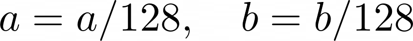

<ins>[Preview](#preview)</ins>&nbsp;&nbsp;&nbsp;
<ins>[Details of Implementation](#Details-of-Implementation)</ins>&nbsp;&nbsp;&nbsp;
<ins>[Network](#Network)</ins>&nbsp;&nbsp;&nbsp;
<ins>[Hyperparameters and Tools](#Hyperparameters-and-Tools)</ins>&nbsp;&nbsp;&nbsp;
<ins>[Results](#Results)</ins>&nbsp;&nbsp;&nbsp;
<ins>[References](#References)</ins>&nbsp;&nbsp;&nbsp;
<ins>[Useful Resources](#Useful-Resources)</ins>&nbsp;&nbsp;&nbsp;
# Preview

# Details of Implementation

## Dataset 

This dataset consists of about **5,000** people's images including family portraits, wedding portraits, and so on.
- [The Images of Groups Dataset (Cornel University)](http://chenlab.ece.cornell.edu/people/Andy/ImagesOfGroups.html)

The images have different dimensions. The average dimension is (688 x 688).

## Preprocessing
1- The Black & White images were removed from the dataset.

2- The dimension of the images was changed to (768 x 768).

3- These RGB color space images were converted to **Lab** color space images.
  
  - Why?
      In the Lab color space only the second(**a**) and third(**b**) channels color the image. Thus, for the training of the Generator, the **L** channel can be ignored. Removing      one channel definitely makes the problem easier.

4- At the end, some sort of normalization was taken:
 - For all values in the **L** channel like x:
 
      
 
 -  For all values in the **a** or **b** channels like x:

      

 -  (These two steps led to having a 3-dimensional matrix (a tensor of the image in **Lab** color space) in which all the values are in the range of [-1,1])
 

# Network
## Generator : 

- ### Input:
  - A batch of images [just channel **L**]
    - A tensor of shape : (Batch size, 1, 768, 768) 
       
- ### Output:
  - The predicted values for the channels **a** and **b**
  
    - A Tensor of shape : (Batch size, 2, 768, 768)

- ### Structure:
  - Unet1

    - Encoder : EfficientNet-b5

    - ImageNet pre-trained weights were used.

      - The input channel was set to 1. 

      - The output channel was set to 2. 

  The **L** channel concatenates to **a** and **b** channels generated from the generator, and the colored image is obtained.  Therefore the generator generates the colored image.

## Discriminator : 

- ### Input:
  - A Batch of images which contains the original image (in a *Lab* color space) and the images drived form the generator.
    - A Tensor of shape : (Batch size*2, 3, 768, 768) 
   

- ### Output:
  - The predicted values of the channels **a** and **b**
  
    - A Tensor of shape : (Batch size, 1, 94, 94)
      
      - The values of the tensor, determ

- ### Structure:

# Hyperparameters and Tools
- #### Batch size: 
   - 3 
- #### Optimizers: 
   - Generator: ADAM | Learning rate : 0.001
   - Discriminator: ADAM | Learning rate : 0.001

- #### Weight Decay: 
   - 0.0001
- #### Loss: 
   - Cross entropy
- #### Train vs Validation Split: 
   - Approximately : 0.78 | 0.22  
- #### Tools: 
   - Python - Pytorch ( Using Google Colab Pro )

# References
[1] [Segmentation Models Pytorch - Pavel Iakubovskii](https://github.com/qubvel/segmentation_models.pytorch)

