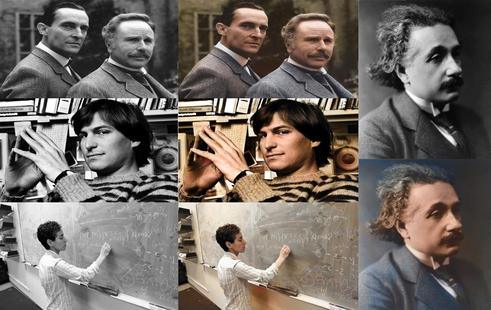
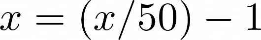
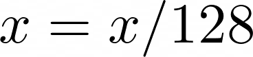
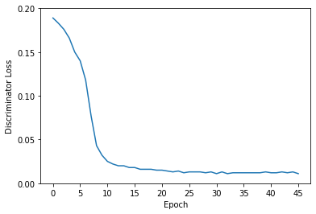
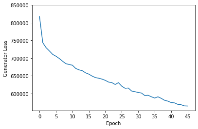

<ins>[Preview](#preview)</ins>&nbsp;&nbsp;&nbsp;
<ins>[Details of Implementation](#Details-of-Implementation)</ins>&nbsp;&nbsp;&nbsp;
<ins>[Networks](#Networks)</ins>&nbsp;&nbsp;&nbsp;
<ins>[Hyperparameters - Losses - Tools](#Hyperparameters---Losses---Tools)</ins>&nbsp;&nbsp;&nbsp;
<ins>[Results](#Results)</ins>&nbsp;&nbsp;&nbsp;
<ins>[References](#References)</ins>&nbsp;&nbsp;&nbsp;
<ins>[Useful Resources](#Useful-Resources)</ins>&nbsp;&nbsp;&nbsp;

The goal of this project is to color the black and white portraits. This project is based on the deep learning concepts and uses 
**Pix2Pix GAN** which is a general approach for image-to-image translation.
# Preview


# Details of Implementation

## Dataset 

This dataset consists of about **5,000** people's images including family portraits, wedding portraits, and so on.
- [The Images of Groups Dataset (Cornel University)](http://chenlab.ece.cornell.edu/people/Andy/ImagesOfGroups.html)

The images have different dimensions. The average dimension is (636 x 788).

## Preprocessing
1- The Black & White images were removed from the dataset.

2- The dimension of the images was changed to (768 x 768).

3- These RGB color space images were converted to **Lab** color space images.
  
  - Why?
      In the Lab color space only the second(**a**) and third(**b**) channels color the image. Thus, for the training of the Generator, the **L-channel**  can be ignored. Removing      one channel definitely makes the problem easier.

4- At the end, some sort of normalization was taken:
 - For all values in the **L-channel** like x:
 
      
 
 -  For all values in the **a-channel** or **b-channel** like x:

      

 -  (These two steps led to having a 3-dimensional matrix (a tensor of the image in **Lab** color space) in which all the values are in the range of [-1,1])
 

# Networks
## Generator : 
- ### Goal:
  - Takes the **L-channel** of the image as an input and generates the **ab-channels** as an output.

- ### Input:
  - A batch of images [**L-channel**]:
    - A tensor of shape : (Batch size, 1, 768, 768) 
       
- ### Output:
  - The predicted values [**ab-channels**]:
  
    - A tensor of shape : (Batch size, 2, 768, 768)

- ### Structure:
  - Unet<sup>1</sup>

    - Encoder : EfficientNet-b5

    - ImageNet pre-trained weights were used.

      - The input channel was set to 1. 

      - The output channel was set to 2. 


  The **L-channel**  concatenates to **ab-channels**  generated from the generator, and the colored image is obtained.  Therefore the generator generates the colored image.

## Discriminator : 
- ### Goal:
  - Takes an image(in **Lab** color space) and then generates a 2-dimensional matrix (94 x 94) in which each value represents that the corresponding part of the image is real or fake (a number that indicates the probability of being Real)
- ### In the Training phase of the Discriminator:
  - #### Input 
    - A batch of images that contains the original images (in a **Lab** color space) and the images generated from the generator:
      - A tensor of shape : (Batch size*2, 3, 768, 768) 
  - #### Output:
    - The generated matrix:
      - A tensor of shape : (Batch size*2, 1, 94, 94)
     
- ### In the Training phase of the Generator:
  - #### Input 
    - A batch of images generated from the generator:
      - A tensor of shape : (Batch size, 3, 768, 768) 
  - #### Output:
    - The generated matrix:
      - A tensor of shape : (Batch size, 1, 94, 94)


    
- ### Structure:
```
       (1) Conv → BN → ReLU
       (2) Conv → BN → ReLU 
       (3) Conv → BN → ReLU 
       (4) Conv → BN → ReLU 
       (5) Conv → Sigmoid
       
       (Please check the source code for more information, especially the number of filters and their sizes)
```

# Hyperparameters - Losses - Tools
- #### Batch size: 
   - 3 
- #### Train vs Test Split: 
   - Approximately : 0.9 | 0.1 
- #### In the Training phase of the Discriminator:
  - ##### Optimizer: 
     - ADAM 
       -  ##### Learning Rate : 0.001
   - ##### Loss:
     - 0.5 . BCE(Discriminator(X), Y)

       - If X is a real image, then Y is a tensor in which all the values are 1. 
       - If X is a fake image (the image is derived from the generator), then Y is a tensor in which all the values are 0.
- #### In the Training phase of the Generator:
  - ##### Optimizer: 
     - ADAM 
       -  ##### Learning Rate : 0.001
   - ##### Loss:
     - BCE(Discriminator(X<sub>Generator</sub>), 1<sub>T</sub>) + 10 . |X<sub>Real</sub> - X<sub>Generator</sub>|<sub>1</sub>
     
       - 1<sub>T</sub> is a tensor in which all the values are 1.
       - X<sub>Real</sub> is the real image, and X<sub>Generator</sub> is the fake colored version of  X<sub>Real</sub> derived from the generator.

- #### Tools: 
   - Python - Pytorch (Using Google Colab Pro)

# Results
   Training finished after 46 epochs. In every 3 epochs, the weights of both networks were saved. 
   After reviewing the Test images generated by the generator at every 3 epochs, the epoch led to the best images was obtained. In Epoch 27, the generator generated more realistic Test images. 
   
   The Generator and Discriminator Losses (for Train images) at every epoch are shown in the figures below.

 


# References
[1] [Segmentation Models Pytorch - Pavel Iakubovskii](https://github.com/qubvel/segmentation_models.pytorch)

# Useful Resources
[1] [Understanding PatchGAN](https://sahiltinky94.medium.com/understanding-patchgan-9f3c8380c207)

[2] [How to Develop a Pix2Pix GAN for Image-to-Image Translation](
https://machinelearningmastery.com/how-to-develop-a-pix2pix-gan-for-image-to-image-translation/
)

[3] [Colorizing black & white images](https://towardsdatascience.com/colorizing-black-white-images-with-u-net-and-conditional-gan-a-tutorial-81b2df111cd8)
